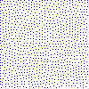

# PoissonDiskDistribution

Procedural generation for placing objects randomly usually needs to not have them overlap. Poisson disk distribution maintains the distance between points, avoiding collisions.

The algorithm begins with a single point (specified or randomly generated) stored in a list. At each iteration, we select a point from the list and generate disks around the point. 
The distance of the disks varies between $2\pi$ and $2\pi + k$ from the active point, where $r$ is the radius and $k$ is how dense the packing is. Then the position of each disk 
is validated to not overlap with others disks. If it does not overlap, it is added to the list; otherwise, the disk is discarded. 

The performance of the algorithm is O(n).

  

